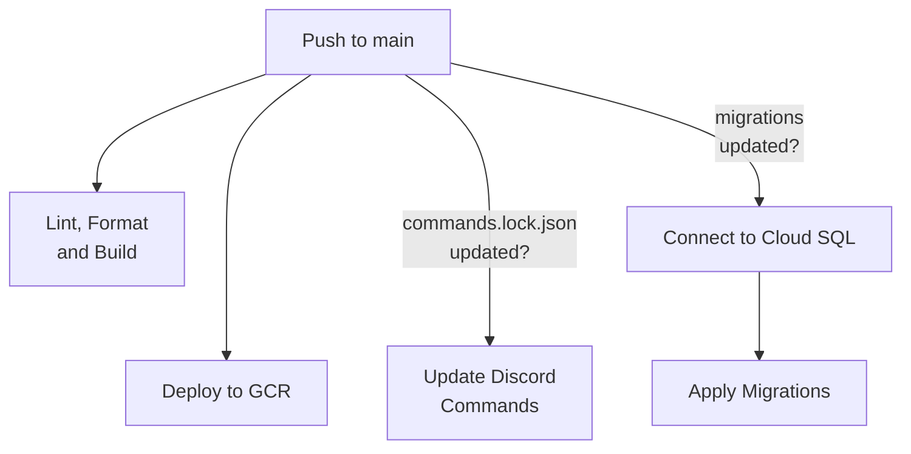

	 
	

		
	

	 
	
	
	

## About
Chuckle is our in-house Discord bot for our internal company server.
We weren't a huge fan of Slack and, most of our target demographic uses Discord.

A few of our favorite (and only :p) features include:
- Circle Back, create reminders to revisit a specific message
- PR Comments, stream PR reviews and updates to a configured thread
- `/hexil`, allow each member to set a custom role/name color

# Development

## Requirements
These are some broad, general requirements for running Chuckle.
- [Rust](https://rust-lang.org/tools/install)
- [Docker](https://docs.docker.com/engine/install/)

## Setup
Before you can actually setup... we have some setup to do!

1. Install [`cargo-make`](https://github.com/sagiegurari/cargo-make#installation) (`cargo install --force cargo-make`)

Cargo doesn't have a native "scripts" feature like Yarn or NPM. Thus, we use `cargo-make` and [`Makefile.toml`](./Makefile.toml).

~~2. Install [`pre-commit`](https://pre-commit.com/#installation) (`pip install pre-commit`)~~

~~We use this for running git hooks.~~ This is handled by the next step.

2. Run `cargo make setup`

This installs necessary components for other scripts and development fun.

### Environment
If it weren't for `sqlx` and it's inability to play nice with `direnv`, we wouldn't also need an `.env` file containing just the `DATABASE_URL`.

1. Install [direnv](https://direnv.net/#basic-installation).

It automatically loads our `.direnv` file.

2. Copy `.envrc.example` to `.envrc` and fill with your environment variables.

3. Ensure `.env` houses your `DATABASE_URL` address.

### Database
We utilize `sqlx`'s compile-time checked queries, which requires a database connection during development.
Additionally, we use `sqlx`'s migrations tool, which is just a treat!

1. Start the database with `docker compose up -d`.

2. Run `sqlx migrate run`

This applies our database migrations.

## Running
Now, running the bot should be as easy as:

1. `cargo make dev`

## Contributing
When making changes to Chuckle, there are a few things you must take into consideration.

If you make any query changes, you must run `cargo sqlx prepare` to create an entry in [`.sqlx`](./.sqlx) to support `SQLX_OFFLINE`.
If you make any command/interaction data changes, you must run `cargo make commands-lockfile` to remake the [commands.lock.json](./chuckle-interactions/commands.lock.json) file.

Regardless, of what scope, you must always ensure Clippy, Rustfmt and cargo-check are satisified, as done with pre-commit hooks.

# Production
We currently host Chuckle on our Google Kubernetes Engine cluster.

## Building Chuckle

todo, see our [.github/workflows](./.github/workflows)
